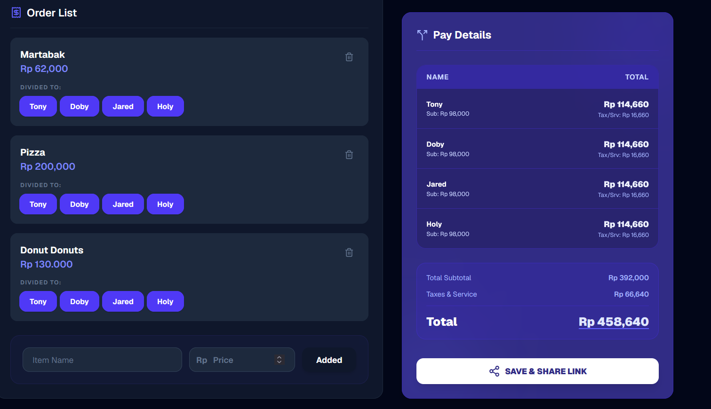

# 🚀 MySplitBill - Smart Bill Splitter

**MySplitBill** is a modern web application designed to help you split bills (dining, shopping, or any other shared expenses) with friends fairly, quickly, and transparently. No more headache computing tax, service charges, or figuring out who ordered what.



## ✨ Key Features

- 💸 **Precision Calculation**: Supports proportional calculation of subtotals, tax (VAT/PPN), and service charges.
- 🌓 **Dark & Light Mode**: A premium, eye-friendly user interface available in both light and dark modes.
- 🔗 **Shareable Links**: Save your bill calculation and generate a unique link to easily share with friends via WhatsApp, Telegram, or other platforms.
- ☁️ **Cloud Sync**: Sign in to permanently save your bill history and access it from any device.
- 🏠 **Local Access (Guest Mode)**: Don't want to sign up? No problem! The application works fully offline and saves your history securely in your local browser storage.
- 📱 **Responsive & Lightweight**: Designed to run seamlessly and look stunning on both mobile devices and desktops.

## 🛠️ Tech Stack

- **Frontend**: [Next.js 15+](https://nextjs.org/) (App Router, Turbopack)
- **Styling**: [Tailwind CSS v4](https://tailwindcss.com/)
- **Database & Auth**: [Supabase](https://supabase.com/)
- **Icons**: [Lucide React](https://lucide.dev/)
- **Theme Management**: [next-themes](https://github.com/pacocoursey/next-themes)

---

## 🚀 Getting Started

### 📋 Prerequisites
- **Node.js**: Version 18 or higher.
- **pnpm**: Recommended package manager.

### ⚙️ Setup Instructions

1. **Clone the repository and navigate to the project directory:**
   ```bash
   cd split-bill-cal
   ```

2. **Configure Environment Variables:**
   Create a `.env.local` file in the root directory and populate it with your Supabase credentials:
   ```env
   NEXT_PUBLIC_SUPABASE_URL=your_supabase_project_url
   NEXT_PUBLIC_SUPABASE_ANON_KEY=your_supabase_anon_public_key
   ```

3. **Install Dependencies:**
   ```bash
   pnpm install
   ```

4. **Run the Development Server:**
   ```bash
   pnpm dev
   ```
   Open [http://localhost:3000](http://localhost:3000) in your browser to see the live application.

5. **Build for Production:**
   ```bash
   pnpm build
   pnpm start
   ```
